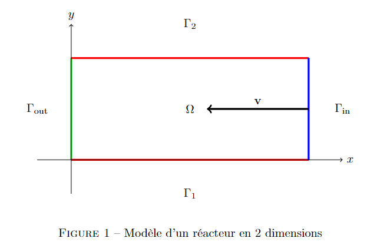
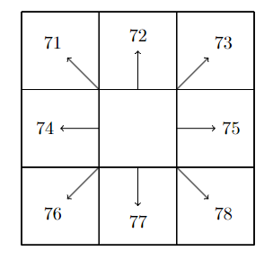

# Optimisation des formes pour l'atténuation du bruit dans les réacteurs des avions FDM
  

## Table of contents

- [Optimisation des formes pour l'atténuation du bruit dans les réacteurs des avions FDM](#optimisation-des-formes-pour-latténuation-du-bruit-dans-les-réacteurs-des-avions-fdm)
  - [Table of contents](#table-of-contents)
  - [The problem](#the-problem)
  - [Execution](#execution)
    - [Parameters set up](#parameters-set-up)
  - [General Considerations](#general-considerations)
    - [Code structure](#code-structure)
    - [Conventions](#conventions)
    - [Improvements to be done](#improvements-to-be-done)
    - [Some other advice](#some-other-advice)
  - [Libraries](#libraries)
    - [External Libraries](#external-libraries)
    - [Own Libraries](#own-libraries)


## The problem

The PDE and its boundary conditions to be solved are the following:

$$
\begin{cases}
\Delta P + k^2(1-i\frac{M}{k}\partial_x)^2 P = 0 & sur \Omega \\
\frac{\partial P}{\partial n} + ikP = 0 & sur \Gamma_{\text{out}} \\
P = e^{ikx}g(r) & sur \Gamma_{\text{in}} \\
\frac{\partial P}{\partial n} + i\chi \frac{kZ_0}{Z}(1-i\frac{M}{k}\partial_x)^2 P = 0 & sur \Gamma
\end{cases}
$$



This problem is translated into a discrete version using the **Finite Difference Method**, which will end up solving a linear system

$$ A u = b $$

where each row of the linear system will be the equation that appears at each node of the domain after discretizing the problem.


## Execution

The main module to execute the script is `main2.py`. If the user wants to run this file for an irregular domain, it must provide an image in `images` directory.

The user can define the parameters of the problem at `parameters.py` and the type of problem to solve at `main2.py` by changing *init_params* or by using the interface provided, which needs to be uncommented for using. It can be seen in the following image where to find this.

```python
init_params = aff.traitement()
```

### Parameters set up

To define the parameters of the code, there are only two files where to do this. The first one is in `parameters.py` where the user can define the parameters of the PDE equation, like $k$, $M$ and $Z$. To define which kind of model or problem to solve, this is done inside `main2.py`, where it can be specified in `init_params` dictionary, which is very similar to a *json* object.

```python
init_params = {
    "Lx": 1,
    "Ly": 1,
    "bc_side": 0,               # 0: "dirichlet" ou 1: "robin" ou 2: "neumann"
    "operators_used": 1,        # 0: "basic" ou 1: "complet"
    "domain_shape": 0,          # we can choose: 0: rect - 1: img - 2: array - 3: irregular
    "final_setup" : False,       # will use f = 0 and g = y ( L - y )
    "multiplier_4_increasing_resolution": 2,
    "display" : True,
    "save" : False, 
    "image_path" : "modified_irregular05_v4.png",
    "g" : lambda x, y: 0,        # the function to apply to the right side if final_setup = True
}
```

It is very self explanatory, but `Lx` is the length of the domain on the x-axis, `Ly` is the length of the domain on the y-axis, `bc_side` is a number that will define which BC to use on the upper and lower sides, the `operators_used` is also a number defining if to use $\Delta P + k^2 P = f$ (basic) or $\Delta P + k^2(1-i\frac{M}{k}\partial_x)^2 P = f$ (complete). `domain_shape` will define the type of domain, `final_setup` is a boolean, where when it is `True`, it will use `f` = 0, `g` defined in `init_params` and an image as the domain. `multiplier_4_increasing_resolution` is an integer which defines $\frac{1}{\Delta x}$. `display` is a boolean to suppress the impression of the final results of the model, `save` is also a boolean, which when `True` it will save the graphs generated. `image_path` is the name of the image inside `images` to use as the domain. `g` is the function which will define the input wave to the right when `final_setup` is `True`.


## General Considerations

### Code structure

The code is very linear and straight forward. The logic sequence is in `main2.py`, however, the complexity comes from the personalization of the parameters. To control the information within the code, a major class `SystemBuilder` is used to save all the information, and then provide this information to each function, class or method in the code. By this way, we avoid having multiple instances of the same information and having more than one label for the same thing.

Corcerning the flow of the code, it is the following which can almost be seen in `main2.py`

1. The main parameters are saved.
    1. The matrix `T` categorizing the domain is created by using `fonction_analytique.setting_matrix_domain()`
2. The matrix $A$ sparse and the vector $b$ are created from the restriction and the conditions of the problem.
3. The linear system is solve by using `scipy.sparse.linalg.spsolve()` which is an efficient way to solve sparse systems.
4. The canvas for the plots are built and displayed.

### Conventions

- It must be mentioned that the code follows a column-wise convention to create the matrix $A$ and vector $b$, i.e., the index corresponding to the elements in $b$ are $$k = row + column \cdot NodesY $$, where $k$ is the index of $b$, $row$ and $column$ are the row and column indeces of the domain matrix where the node is, and $NodesY$ is the amount of vertical nodes in the domain.
- The another important convention is the way how the domain nodes where categorized and saved in the matrix `T`. This is important, because by this way we could identified them from domain points, boundary conditions and outside the domain. It is also important to provide the direction of the normal vector of the boundary nodes, because this information is required in the equations of the boundary conditions of the PDE.
The categorization is the following:
  1. 0 or 1: outside the domain.
  2. 2: inside the domain.
  3. 7 or 70: Neumann left boundary condition (wave going outside).
  4. 7_: Up and down boundary condition. (The second number indicates the direction of the normal vector).
  5. 8_ or 8: Right boundary condition (wave coming inside).
  6. 9_: Neumann BC and upper or lower BC simultaneously (for the corners).

  The direction of the normal vector is portrayed in the following figure.
  

### Improvements to be done

1. Improve the implementation of the library `Mapping`, since it is not efficient and prone to give an incorrect categorization of the domain.
2. Implement errors for other norms like $H^1$, $L^1$ or $L^{\infty}$.
3. Implement a visualization of the differences between the adyacent nodes. This will provide complementary information to the $H^1$ norm.
4. Recheck the **Robin** boundary conditions, since they are the ones that are not converging while $\Delta x$ or $\Delta y$ goes to zero (The user can use the the file `error_model_graph()` to check this information). It must be mentioned that the **Neumann** boundary condition is the same as the Robin one, but the parameter $\chi$ equal to 0. In the code we make `eta` equal to 0 since we defined $\eta = \chi \frac{Z}{Z_0}$.
5. Also, recheck if the implementation for the irregular boundary condition works, because we tried to find an analytical solution and implement a numerical solution, but it gave percentage of error. Therefore, there might also be an error in this part.
6. There can also be an error with the **left hand side boundary condition** because if you run the dirichlet BC, the error appear more close to the left part of the graph. It can also be cause a bad implementation of the grid and there is an offset between the nodes and the analytical solution. (It is just a guess).
7. It can be noted also, that there exists a slight chance of having errors for the complicated boundary conditions because of computer precision, since the functions implemented are quite complicated. 
8. Lastly, it is important to take into consideration the borders that have two different border conditions applying (like Neumann on the left and Robin on the top), this will provide big errors on the corner left nodes of the grid (we already solve this for some cases). This nodes will have a notation convention of the matrix `T` of the domain as 9_.

### Some other advice

- The way how we got the analytical solution was quite simple. First, it is needed to find a solution of the problem that fits the boundary conditions (a polynomial is always a way to start guessing the solution). This is the hardest part, but after finding a solution that fits the BC, you apply the operator of the PDE to the solution and it will provide a function . This is the force function which in the code is called $f$. (For checking an analytical solution, it doesnt need to have at this point a force function equal to 0, because the solution found isn't a solution to the operator). Using a program like mathematica wolfram, the function $f$ is easy to obtain and to code. The down side of this method, is that at some point, the functions $f$ start to get overly complicated, which might provide error at calculation time (maybe this is the errors we found while trying to check the boundaru conditions for the irregular domain).

    > lambda x,y : x + y^2 
    > > lambda is a python function that can be used to define a function in one line. The first part is the arguments of the function and the second part is the function itself.

- Now, this functions of the analytical solution, the force $f$ and the incoming wave magnitude $g$ normally goes inside of the file `system_builder.py` in the method `SystemBuilder.set_functions()`, where right now there are functions defined for the different kind of problems. The user is encouraged to modify this method to try out new analytical solutions.
- When using the `Mapping` class, it is important to have the image in the `images` directory. Also, the image must be black and white. The black part will be the boundary and the white could be either outside or inside the domain, however, the domain must be fully closed. Additionally, the values of the pixels should be pure black $(0, 0, 0)$ or pure white $(255, 255, 255)$.
- To check the convergence of the code, the user can use the metdod `SystemBuilder.plot_error_vs_h()`. This method will plot the error versus the step size $\Delta x$ or $\Delta y$. This is already implemented at `error_model_graph()`. 
- The user could also use the file `testing_mapping.py` which is used for debugging the `Mapping` output. This file will provide a graph with different colors for the different categories of the domain and BC. This is useful to check if the domain and BC are correctly categorized.


## Libraries

### External Libraries

The list of external libraries used is the following:

1. `numpy`
2. `pandas`
3. `scipy` : `sparse.csr_matrix()` `sparse.linalg.spsolve()`
4. `time` : `time()`
5. `os` : `mkdir()` `path.join()`
6. `matplotlib` : `pyplot`
7. `typing` : `List` `Union` `Callable` `Optional`

### Own Libraries

Each class or functions have a brief description of what they do. The list of libraries is the following:


1. `system_builder`:
    1. `SystemBuilder`: This class is responsible for building a system and plotting the error versus h.
    2. `plot_error_vs_h()`: This method plots the error versus h. (for checking the convergence of the method)
2. `matrice_operateurs_wholeLaplace`:
    1. `CSRBuilder`: This class is responsible for building a Compressed Sparse Row (CSR) matrix.
    2. `laplacien_csr()`: This method calculates the matrix for the Laplacian operator using CSR format.
    3. `identite_csr()`: This method calculates the matrix for the identity operator using CSR format.
    4. `Dx2_csr()`: This method calculates the matrix for the second derivative operator using CSR format.
    5. `Dx1_csr()`: This method calculates the matrix for the first derivative operator using CSR format.
    6. `force_test()`: This method calculates the force matrix for testing purposes using CSR format.
    7. `BC_neumann_csr()`: This method applies Neumann boundary conditions to the CSR matrix.
    8. `BC_onde_csr()`: This method applies wave boundary conditions to the CSR matrix.
    9. `BC_up_down_csr()`: This method applies up-down boundary conditions to the CSR matrix.
3. `matrice_operateurs_basicLaplace`:
    1. `CSRBuilder`: This class is responsible for building a Compressed Sparse Row (CSR) matrix.
    2. `laplacien_csr()`: This method calculates the matrix for the Laplacian operator using CSR format.
    3. `identite_csr()`: This method calculates the matrix for the identity operator using CSR format.
    4. `Dx2_csr()`: This method calculates the matrix for the second derivative operator using CSR format.
    5. `Dx1_csr()`: This method calculates the matrix for the first derivative operator using CSR format.
    6. `force_test()`: This method calculates the force matrix for testing purposes using CSR format.
    7. `BC_neumann_csr()`: This method applies Neumann boundary conditions to the CSR matrix.
    8. `BC_onde_csr()`: This method applies wave boundary conditions to the CSR matrix.
    9. `BC_up_down_csr()`: This method applies up-down boundary conditions to the CSR matrix.
    10. `BC_dirichlet_csr()`: This method applies Dirichlet boundary conditions to the CSR matrix.
4. `fonction_analytique`:
    1. `Metric`: This class represents a metric of units distances for the solutions.
    2. `setting_matrix_domain()`: This method sets the matrix domain for the analytical solution.
    3. `plot_analytical_solution()`: This method plots the analytical solution.
    4. `plot_numerical_real()`: This method plots the real part of the numerical solution.
    5. `plot_numerical_img()`: This method plots the imaginary part of the numerical solution.
    6. `erreurs()`: This method calculates the errors between the analytical and numerical solutions.
    7. `erreur_sur_domaine()`: This method calculates the error difference on the domain.
    8. `VisualizeSparseMatrix`: This class is responsible for visualizing a sparse matrix. (useful for debugging)
    9. `VisualizerMatrix`: This class is responsible for visualizing a matrix. (useful for debugging)
5. `Mapping`:
    1. `Mapping`: This class is responsible for mapping the domain from an image.
    2. `get_domain()`: This method gets the domain from the image.
    3. `get_boundary()`: This method gets the boundary from the domain.
    4. `get_outside()`: This method gets the outside from the domain.
    5. `get_boundary_conditions()`: This method gets the boundary conditions from the domain.
    6. `get_normal()`: This method gets the normal vector from the domain.
    7. `get_domain_points()`: This method gets the domain points from the domain.
    8. `get_boundary_points()`: This method gets the boundary points from the domain.
    9. `get_outside_points()`: This method gets the outside points from the domain.
    10. `get_boundary_conditions_points()`: This method gets the boundary conditions points from the domain.
    11. `get_normal_points()`: This method gets the normal vector points from the domain.
    12. `get_domain_matrix()`: This method gets the domain matrix from the domain.
    13. `get_boundary_matrix()`: This method gets the boundary matrix from the domain.
    14. `get_outside_matrix()`: This method gets the outside matrix from the domain.
    15. `get_boundary_conditions_matrix()`: This method gets the boundary conditions matrix from the domain.
    16. `get_normal_matrix()`: This method gets the normal vector matrix from the domain.
    17. `get_domain_points()`: This method gets the domain points from the domain.
    18. `get_boundary_points()`: This method gets the boundary points from the domain.
    19. `get_outside_points()`: This method gets the outside points from the domain.
    20. `get_boundary_conditions_points()`: This method gets the boundary conditions points from the domain.
    21. `get_normal_points()`: This method gets the normal vector points from the domain.
    22. `get_domain_matrix()`: This method gets the domain matrix from the domain.
    23. `get_boundary_matrix()`: This method gets the boundary matrix from the domain.
    24. `get_outside_matrix()`: This method gets the outside matrix from the domain.
    25. `get_boundary_conditions_matrix()`: This method gets the boundary conditions matrix from the domain.

## Contact information

Feel free to contact us in case of doubt.

- **Clément Fouquet**: clement.fouquet@student-cs.fr
- **Martín Pasche**: martin.pasche@student-cs.fr 